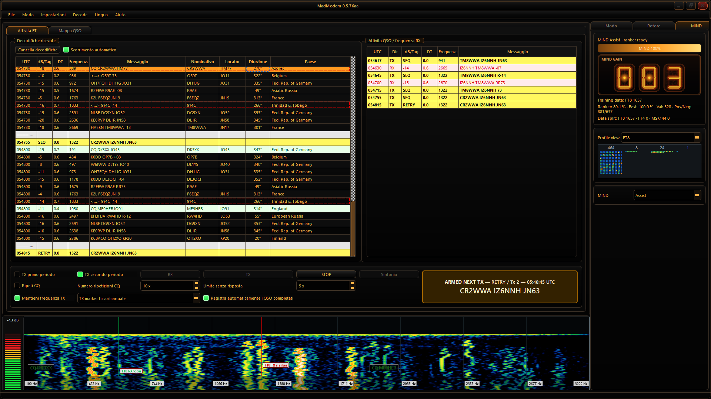
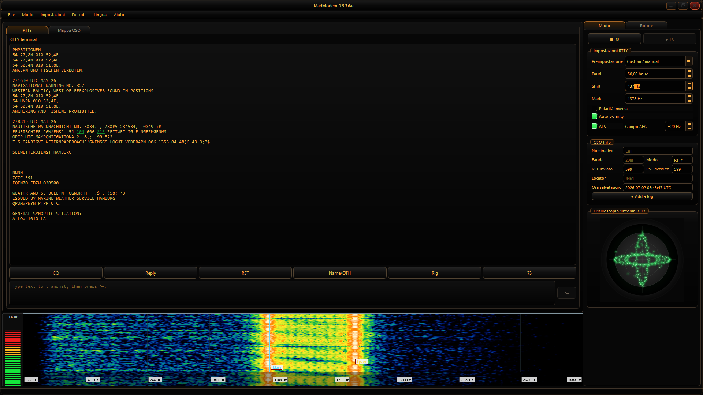

# MadModem
## All-in-one digital modem for ham radio

**Less fragmentation, more radio.**  
**Meno frammentazione, più radio.**

MadModem is an experimental all-in-one digital modem and station hub for amateur radio operators. It brings together digital modes, radio CAT control, antenna rotor control, QSO mapping and logbook tools in a single application.

MadModem è un modem digitale tutto-in-uno sperimentale per radioamatori. Riunisce modi digitali, controllo CAT della radio, controllo rotore, mappa QSO e logbook in un’unica applicazione.

---

## What is MadModem?

MadModem is designed for radio amateurs who want to operate different digital modes without constantly switching between many separate applications. It covers both historical modes such as RTTY and modern modes such as FT8/FT4, while also integrating station tools that are usually handled by separate programs.

MadModem è pensato per radioamatori che vogliono operare in diversi modi digitali senza dover passare continuamente da un programma all’altro. Include modi storici come RTTY e modi moderni come FT8/FT4, integrando anche strumenti di stazione che normalmente richiederebbero software separati.

The goal is simple: one practical hub for digital ham radio activity.

L’obiettivo è semplice: un unico hub pratico per l’attività digitale radioamatoriale.

---

## Why MadModem?

MadModem was born from a practical need: reducing software fragmentation in the ham radio shack. Instead of using separate applications for FT8, RTTY, SSTV, CAT control, antenna rotor control, logbook and mapping, MadModem aims to provide a single integrated operating environment.

MadModem nasce da un’esigenza concreta: ridurre la frammentazione software in stazione radio. Invece di usare applicazioni separate per FT8, RTTY, SSTV, controllo CAT, rotore d’antenna, logbook e mappa, MadModem vuole offrire un unico ambiente operativo integrato.

It is aimed especially at:

- experimental radio amateurs;
- operators interested in historical digital modes;
- users who prefer one integrated program instead of many separate tools.

È rivolto soprattutto a:

- radioamatori sperimentatori;
- appassionati di modi digitali storici;
- utenti che preferiscono un software unico invece di tanti programmi separati.

---

## Project status

MadModem is experimental but usable. It is under active development and is tested primarily on Linux. Windows and macOS builds are available and functional, but some features may still require testing and refinement.

MadModem è sperimentale ma utilizzabile. È in sviluppo attivo e viene testato principalmente su Linux. Sono disponibili build funzionanti per Windows e macOS, ma alcune funzionalità possono essere ancora da testare e rifinire.

The most tested and currently most mature digital modes are:

- FT8;
- FT4;
- RTTY.

Le modalità più testate e attualmente più mature sono:

- FT8;
- FT4;
- RTTY.

Other modes are present in the project, but should be considered experimental or still under refinement.

Gli altri modi sono presenti nel progetto, ma devono essere considerati sperimentali o ancora in fase di affinamento.

---

## Main features

### Integrated digital modes

MadModem includes multiple digital modes in a single application, covering both modern weak-signal operation and historical text/image modes.

MadModem include più modi digitali in una sola applicazione, coprendo sia i modi moderni per segnali deboli sia modi storici testuali e immagine.

### FT8 / FT4 workflow

FT8 and FT4 are among the most tested modes in MadModem. The application includes receive/transmit support and an integrated operating workflow for digital QSOs.

FT8 e FT4 sono tra i modi più testati in MadModem. L’applicazione include supporto RX/TX e un flusso operativo integrato per i QSO digitali.

### RTTY and historical digital modes

RTTY is one of the strongest and most tested parts of the project. MadModem also aims to preserve and modernize the experience of older digital modes inside a more integrated application.

RTTY è una delle parti più solide e testate del progetto. MadModem punta anche a preservare e modernizzare l’esperienza dei modi digitali storici dentro un’applicazione più integrata.

### SSTV, WEFAX and image modes

MadModem includes support for image-oriented modes such as SSTV and WEFAX/MeteoFax. These areas are present and under active testing/refinement.

MadModem include supporto per modi orientati all’immagine come SSTV e WEFAX/MeteoFax. Queste aree sono presenti e in fase di test e rifinitura.

### CW and experimental modes

CW, Feld Hell/Hellschreiber, BPSK/QPSK, MFSK, MSK144 and Q65 are included as experimental or developing areas of the project.

CW, Feld Hell/Hellschreiber, BPSK/QPSK, MFSK, MSK144 e Q65 sono inclusi come aree sperimentali o in sviluppo.

### CAT radio control through Hamlib

MadModem integrates CAT radio control through Hamlib, allowing the application to communicate with compatible radios for frequency, mode and PTT management. CAT is designed to work together with the digital modes, logbook, map and rotor tools.

MadModem integra il controllo CAT della radio tramite Hamlib, permettendo al software di comunicare con radio compatibili per gestione di frequenza, modo operativo e PTT. Il CAT è pensato per lavorare insieme ai modi digitali, al logbook, alla mappa e al controllo rotore.

### Antenna rotor control

MadModem includes integrated antenna rotor control, with support for standard azimuth rotors and alt-az systems. It supports manual pointing, automatic pointing and lunar tracking, making rotor management part of the same operating environment instead of a separate tool.

MadModem include il controllo integrato del rotore d’antenna, con supporto per rotori azimutali classici e sistemi alt-az. Supporta puntamento manuale, puntamento automatico e tracking lunare, integrando la gestione del rotore nello stesso ambiente operativo.

### Integrated logbook

MadModem includes an integrated logbook with QSO recording, search/query tools and advanced export, including ADIF support and filtering by period, mode, callsign and locator.

MadModem include un logbook integrato con registrazione QSO, strumenti di ricerca/query ed export avanzato, incluso supporto ADIF e filtri per periodo, modo, nominativo e locator.

### QSO map and Maidenhead locator support

MadModem includes an integrated QSO map with Maidenhead locator support. It can show the operator’s home position, visualize contacts geographically and connect the radio activity with the logbook and digital modes.

MadModem include una mappa QSO integrata con supporto ai locator Maidenhead. Permette di visualizzare la posizione della stazione, i collegamenti effettuati e il rapporto geografico tra attività radio, logbook e modi digitali.

### Multilingual interface

MadModem includes a multilingual interface. Translations are available or in progress for:

- Italian;
- English;
- French;
- German;
- Norwegian;
- Czech.

Some translations may still be incomplete or require refinement.

MadModem include un’interfaccia multilingua. Le traduzioni sono disponibili o in lavorazione per:

- Italiano;
- Inglese;
- Francese;
- Tedesco;
- Norvegese;
- Ceco.

Alcune traduzioni possono essere ancora incomplete o da rifinire.

---

## Supported digital modes

### Well tested / Più testati

- FT8
- FT4
- RTTY

### Experimental or under refinement / Sperimentali o da rifinire

- SSTV
- CW
- Feld Hell / Hellschreiber
- WEFAX / MeteoFax
- BPSK / QPSK
- MFSK
- MSK144
- Q65

---

## Supported platforms

MadModem is developed and tested primarily on Linux. Prebuilt experimental packages are also available for Windows and macOS when generated by the release workflow.

MadModem viene sviluppato e testato principalmente su Linux. Sono disponibili anche pacchetti sperimentali per Windows e macOS quando generati dal workflow di release.

Current target platforms:

- Linux x86_64
- Windows x86_64
- macOS Apple Silicon
- macOS Intel

---

## Screenshots

Screenshots will be added in the `docs/images/` directory.

Le schermate verranno aggiunte nella cartella `docs/images/`.

Planned screenshot gallery:

- Main window with FT8/FT4 waterfall;
- RTTY operation;
- rotor/CatRotator and tracking tools;
- logbook with query/export;
- QSO map and Maidenhead view;
- settings window.

Galleria schermate:

- finestra principale con waterfall FT8/FT4;
[MadModem main FT8 view](docs/images/madmodem-main-ft8.png)
- operatività RTTY;
[MadModem RTTY view](docs/images/madmodem-rtty.png)
- rotore/CatRotator e strumenti di tracking;
- logbook con query/export;
- mappa QSO e vista Maidenhead;
- finestra impostazioni.

<!--
Suggested image paths for future screenshots:





-->

---

## Download

Download the latest release from the GitHub Releases page.  
Prebuilt packages are provided for Linux, Windows and macOS when available.

Scarica l’ultima versione dalla pagina GitHub Releases.  
Quando disponibili, vengono forniti pacchetti già compilati per Linux, Windows e macOS.

---

## Building from source

MadModem can be built from source using the provided build scripts.

The project is written in C++/Qt and requires a working Qt development environment, CMake, a modern C++ compiler and the required development libraries for audio, serial/CAT, DSP and packaging support. Some third-party components, including Hamlib, may be bundled or built as part of the source tree depending on the platform.

On Linux, the main helper script is:

```bash
./build_all.sh
```

Typical build requirements include:

- CMake;
- a modern C++ compiler with C++17 support;
- Qt 5 development packages;
- Hamlib or bundled Hamlib support;
- FFTW3;
- OpenMP-capable compiler/runtime;
- audio and serial port development libraries;
- standard build tools for the target platform.

MadModem può essere compilato da sorgente usando gli script inclusi nel repository.

Il progetto è scritto in C++/Qt e richiede un ambiente di sviluppo Qt funzionante, CMake, un compilatore C++ moderno e le librerie di sviluppo necessarie per audio, seriale/CAT, DSP e packaging. Alcuni componenti di terze parti, incluso Hamlib, possono essere inclusi o compilati insieme al sorgente a seconda della piattaforma.

Su Linux lo script principale è:

```bash
./build_all.sh
```

Requisiti tipici di compilazione:

- CMake;
- compilatore C++ moderno con supporto C++17;
- pacchetti di sviluppo Qt 5;
- Hamlib o supporto Hamlib incluso nel sorgente;
- FFTW3;
- compilatore/runtime con supporto OpenMP;
- librerie di sviluppo per audio e porta seriale;
- strumenti di build standard per la piattaforma di destinazione.

---

## Author

MadModem is developed by **Lucian-Ioan Papadopol, IZ6NNH**.

The project comes from practical ham radio use, digital modes experimentation, homebrew electronics and the broader MadExp laboratory activity.

MadModem è sviluppato da **Lucian-Ioan Papadopol, IZ6NNH**.

Il progetto nasce dall’attività radio reale, dalla sperimentazione sui modi digitali, dall’elettronica homebrew e dall’attività più ampia del laboratorio MadExp.

Author links:

- MadExp: <https://www.madexp.it/>
- QRZ profile: <https://www.qrz.com/db/IZ6NNH>

---

## License

MadModem is released under the **GNU GPLv3** license.

MadModem includes or interfaces with third-party open-source components. See `THIRD_PARTY_NOTICES.md` for details.

MadModem è rilasciato sotto licenza **GNU GPLv3**.

MadModem include o si interfaccia con componenti open-source di terze parti. Per i dettagli vedere `THIRD_PARTY_NOTICES.md`.

