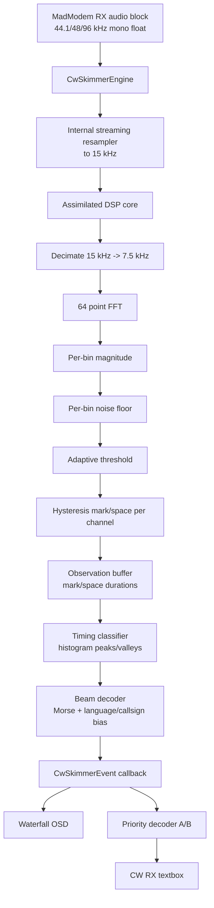

# CW Skimmer Architecture

## Target architecture inside MadModem



## Important design choice

The new block is not a single-frequency CW decoder. It is a small skimmer. The DSP scans six overlapping fixed channel groups over the low audio spectrum and produces decode candidates per channel. MadModem can later map those channel audio frequencies onto the visible waterfall frequency scale.

## Internal channel layout

The assimilated DSP uses:

- input to core: 15 kHz;
- internal decimation: 7.5 kHz;
- FFT size: 64;
- FFT bin width: 117.1875 Hz;
- channels: 6;
- bins per channel: 5.

Approximate channel centers:

| Channel | Approx. center audio frequency |
|---:|---:|
| 0 | 292.97 Hz |
| 1 | 878.91 Hz |
| 2 | 1464.84 Hz |
| 3 | 2050.78 Hz |
| 4 | 2636.72 Hz |
| 5 | 3222.66 Hz |

This is intentionally coarse in this first port. The next MadModem integration step can either keep this layout or generalize channel spacing/FFT size after the baseline is validated.

## Library boundary

Public API:

```text
MadModem audio -> CwSkimmerEngine -> events/states/magnitudes
```

Private assimilated core:

```text
cw_dsp/cw_classifier/cw_decode/cw_data/dictionary/fft/utils
```

No Qt headers are used by the library. This keeps it testable from CLI and easy to embed in MadModem.
